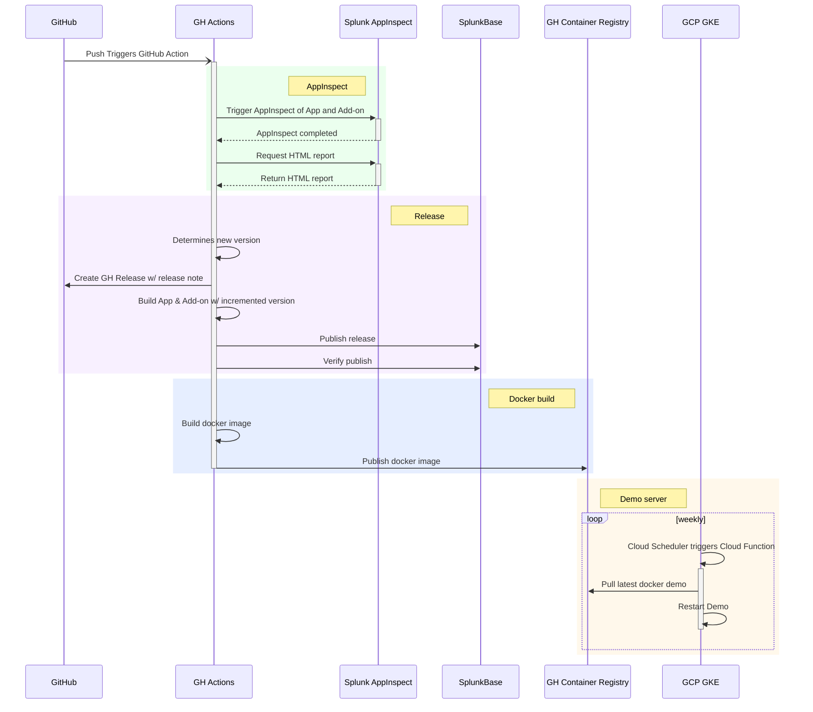

# Developer Documentation and Contribution Guidelines

- [How to contribute](#how-to-contribute)
- [Where to start](#where-to-start)
- [New to open source?](#new-to-open-source)
- [Fixing a typo, or a one or two line fix](#fixing-a-typo-or-a-one-or-two-line-fix)
- [Bug fixes and features](#bug-fixes-and-features)
- [Test changes in your branch](#test-changes-in-your-branch)
- [Publish a new release (for maintainers)](#publish-a-new-release-for-maintainers)
- [CI/CD Release Process](#cicd-release-process)

## How to contribute

:+1::tada: First off, thanks for taking the time to contribute! :tada::+1:

It's people like you that make security open source such a force in preventing
successful cyber-attacks. Following these guidelines helps keep the project
maintainable, easy to contribute to, and more secure. Thank you for taking the
time to follow this guide.

## Where to start

There are many ways to contribute. You can fix a bug, improve the documentation,
submit bug reports and feature requests, or take a first shot at a feature you
need for yourself.

Pull requests are necessary for all contributions of code or documentation.

## New to open source?

If you're **new to open source** and not sure what a pull request is, welcome!!
We're glad to have you! All of us once had a contribution to make and didn't
know where to start.

Even if you don't write code for your job, don't worry, the skills you learn
during your first contribution to open source can be applied in so many ways,
you'll wonder what you ever did before you had this knowledge. It's worth
learning.

[Learn how to make a pull request](https://github.com/PaloAltoNetworks/.github/blob/master/Learn-GitHub.md#learn-how-to-make-a-pull-request)

## Fixing a typo, or a one or two line fix

Many fixes require little effort or review, such as:

> - Spelling / grammar, typos, white space and formatting changes
> - Comment clean up
> - Change logging messages or debugging output

These small changes can be made directly in GitHub if you like.

Click the pencil icon in GitHub above the file to edit the file directly in
GitHub. This will automatically create a fork and pull request with the change.
See:
[Make a small change with a Pull Request](https://www.freecodecamp.org/news/how-to-make-your-first-pull-request-on-github/)

## Bug fixes and features

For something that is bigger than a one or two line fix, go through the process
of making a fork and pull request yourself:

> 1. Create your own fork of the code
> 2. Clone the fork locally
> 3. Make the changes in your local clone
> 4. Push the changes from local to your fork
> 5. Create a pull request to pull the changes from your fork back into the
>    upstream repository

Please use clear commit messages so we can understand what each commit does.
We use the [conventional commit](https://www.conventionalcommits.org) standard.
We'll review every PR and might offer feedback or request changes before
merging.

## Test changes in your branch

Requires docker and docker-compose.

```shell
cd test/standalone-with-data
docker-compose up -d --build
```

This takes several minutes the first time you run it. After a while, point your
browser to http://localhost:8001 for a Splunk server with sample logs you can
use to test the changes in your branch. After the Splunk server comes up, it
could take several more minutes for logs to show up on the server.

To save time in future tests, use `docker-compose stop` and
`docker-compose start` to turn the server off and on between testing
sessions. To completely reset the test environment type
`docker-compose down -v && docker-compose up -d --build`.

Note: Any change you make to the App or Add-on will show up immediately in
Splunk. There is a second docker container that monitors the App/Add-on
directories and reloads them in Splunk when a change is detected.

## Publish a new release (for maintainers)

```
# Test the release process on develop
# (this requires node and semantic-release npm package)
semantic-release --dry-run --no-ci --branches=develop

# Verify in the output that the next version is set correctly
# and the release note is generated correctly

# Merge develop to master and push
git checkout master
git merge develop
git push origin master

# At this point, GitHub Actions is testing the release
# then building it for publication

# Now, sync your local with the remote to pull the new
# tags created in the release process
git fetch --tags
git checkout develop

# Now you're ready to branch again and work on the next feature.
```

## CI/CD Release Process


